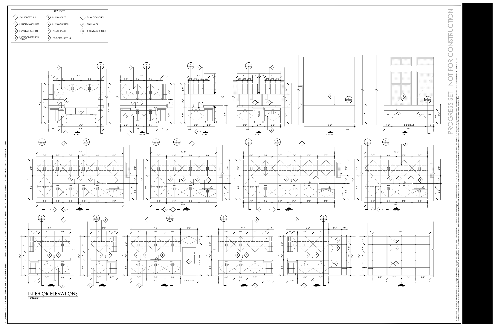
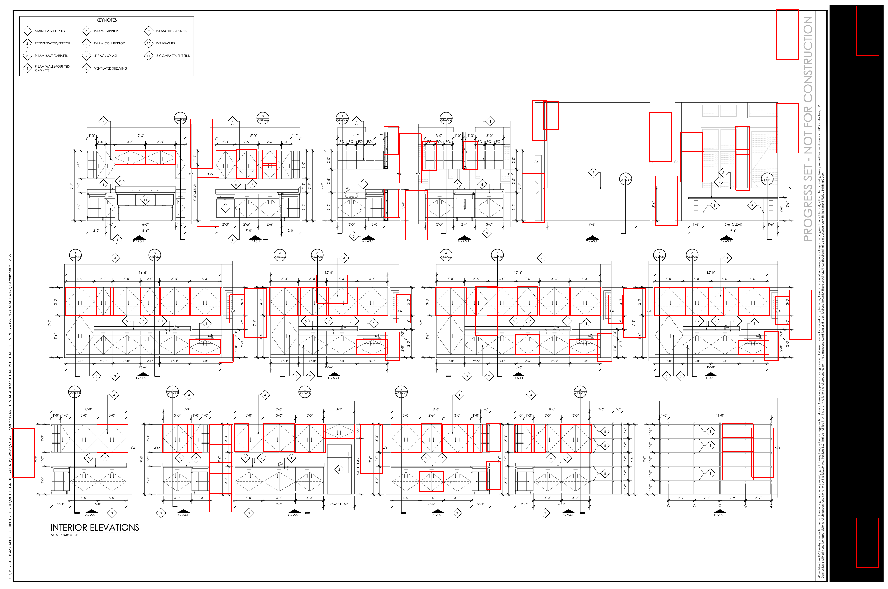

# Sketch Template Matcher

A robust and scalable Python tool for detecting templates (e.g., cabinet components) in sketch-style architectural or furniture drawings using computer vision techniques.

This tool supports:

* Multiscale template matching
* Smart clustering with DBSCAN
* Visual and CSV output of detected elements

---

## Example Output

| Input Image                         | Detected Templates                  |
| ----------------------------------- | ----------------------------------- |
|  |  |

---

## Features

* **Preprocessing for Sketches** — Adaptive thresholding + dilation to enhance lines
* **Multiscale Template Matching** — Resizes templates across scales from 20% to 100%
* **Clustering with DBSCAN** — Removes noise and groups overlapping matches
* **Match Verification** — Confirms validity with shape and content check
* **CSV + Image Output** — Easily visualize or export results

---

## Project Structure

```
.
├── templates/
│   └── WallCabinet/           # Template images (components to match)
├── results/
│   ├── marked_image.png       # Output image with rectangles around matches
│   └── detections.csv         # CSV with match metadata
├── matching_template.py       # Main script
├── requirements.txt           # Python dependencies
└── README.md                  # This file
```

---

## Configuration

Set these in the script (top section):

| Variable              | Description                                  | Default                    |
| --------------------- | -------------------------------------------- | -------------------------- |
| `TEMPLATE_DIR`        | Directory containing templates               | `templates/WallCabinet`    |
| `RESULT_IMAGE_PATH`   | Output path for annotated image              | `results/marked_image.png` |
| `CSV_OUTPUT_PATH`     | Output CSV path                              | `results/detections.csv`   |
| `THRESHOLD`           | Template match threshold                     | `0.48`                     |
| `CLUSTER_EPS`         | DBSCAN max distance between clustered points | `40`                       |
| `CLUSTER_MIN_SAMPLES` | DBSCAN min samples to form a cluster         | `3`                        |
| `MIN_SIDE_LENGTH`     | Minimum template side size to consider       | `50`                       |

---

## Requirements

* Python 3.8+
* OpenCV
* NumPy
* pandas
* scikit-learn

Install them via:

```bash
pip install -r requirements.txt
```
---

## Usage

Run with the default image:

```bash
python matching_template.py
```

Output will be saved to:

* `results/marked_image.png` — Annotated matches
* `results/detections.csv` — Match details

---

## Sample Output CSV

```csv
template,x,y,w,h
B2.png,110,240,65,80
C2.png,540,220,66,81
C2.png,700,460,75,90
```

---

## Tips

* Templates must be grayscale.
* Templates should represent distinct, consistently drawn components.
* Adjust the `THRESHOLD`, `CLUSTER_EPS`, and `MIN_SIDE_LENGTH` to fit your image resolution and drawing style.

---
